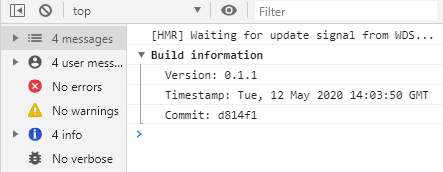

# vue-cli-plugin-build-info

Vue-cli plugin that shows build information in console.

It may be useful if you have established CI out of your control and want to make sure the version everyone sees on staging corresponds to last commit.



## Install
:warning: Make sure you have [vue-cli](https://cli.vuejs.org/)

```
vue --version
```

If you don't have a project created with [vue-cli](https://cli.vuejs.org/) yet:

```
vue create my-app
```

Navigate to the newly created project folder and add the cli plugin. Before installing it, make sure to commit your current changes should you wish to revert them later.

``` js
vue add build-info
```
## Usage

### Vue-cli:
The plugin automatically injects a method into your entry file that allows you to see basic information about the latest build in `console`
``` js
//main.js
import { consoleBuildInfo } from 'vue-cli-plugin-build-info/plugin'
consoleBuildInfo()
```
You can also import a method `getBuildInfo` that return an object `BUILD_INFO` that contains `VERSION, TIMESTAMP, COMMIT` to use it for your own purposes.
``` js
//main.js
import {getBuildInfo} from 'vue-cli-plugin-build-info/plugin'
console.log(getBuildInfo().VERSION)
```
### Nuxt:
The plugin automatically create `vue-cli-plugin-build-info.js` in your plugins directory and inject necessary import in your `nuxt.config.js`. You need to extend your `nuxt.config.js` in two places:

1. Add the file path inside the `plugins` key of our `nuxt.config.js`:
``` js
//nuxt.config.js
const VueCliPluginBuildInfo = require('vue-cli-plugin-build-info')

export  default { 
  plugins: ['~/plugins/vue-cli-plugin-build-info']
}
```
2. Add imported plugin in `build` section `transpile` it:

``` js
//nuxt.config.js
const VueCliPluginBuildInfo = require('vue-cli-plugin-build-info')

export  default { 
  build: {  
    transpile: ['vue-cli-plugin-build-info'],  
    plugins: [  VueCliPluginBuildInfo  ],
  }
}
```
## Explanations:
```Commit: Unable to retrieve commit information``` - you do not init your local Git repository and your local directory doesn't have a .git folder

## Licence
MIT
